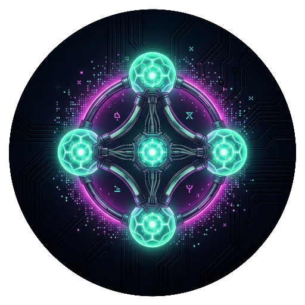
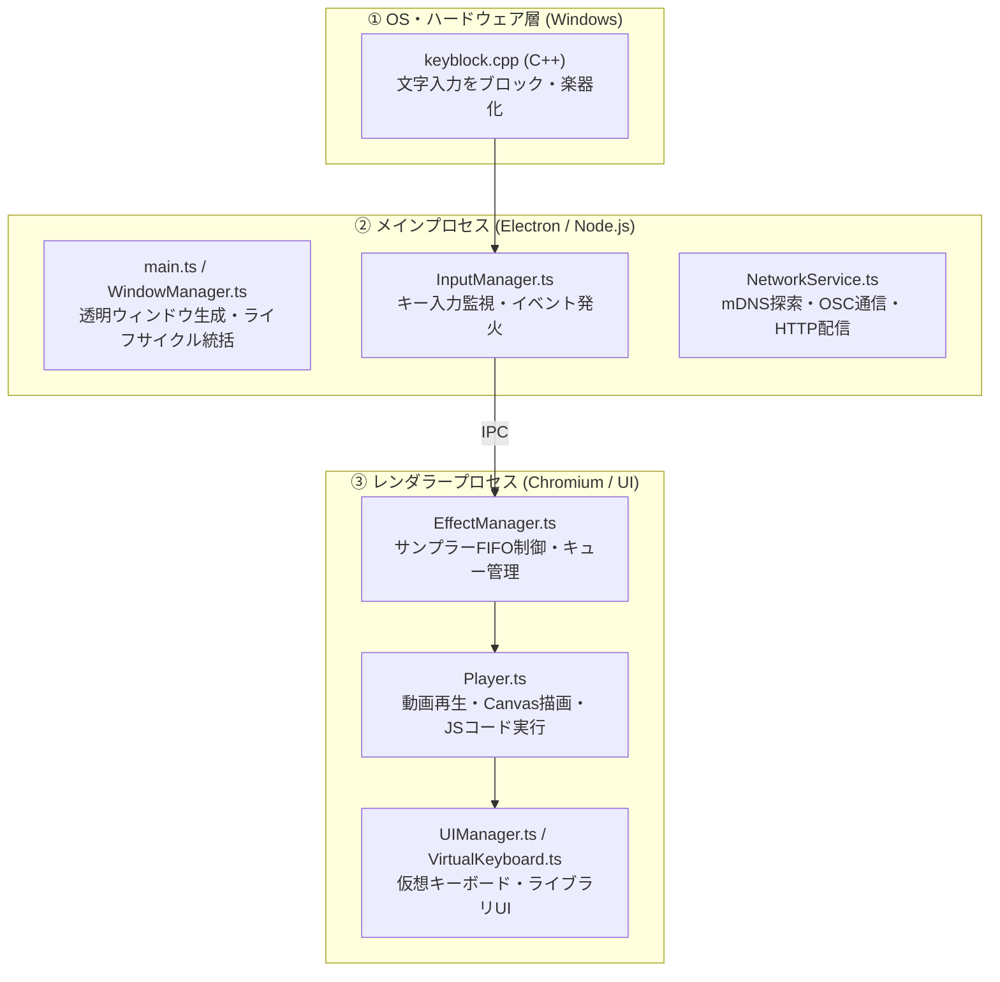

<div align="center">



# ScenePlus+

**PCのデスクトップを透明なキャンバスに、キーボードを楽器（サンプラー）に変える。**  
*Visual effect sampler for creatives and beginners.*

[](package.json)
[](#)
[](https://www.electronjs.org/)
[](https://bun.sh/)
[](LICENSE)

[ダウンロード (Releases)](https://github.com/Neptunity-git/ScenePlus_native/releases) • [クリエイターズガイド](assets/docs/Official_Guide_For_Creators.md) • [要件定義・構想](開発資料/「ScenePlus+」要件定義書.md)

</div>

---

## 🌟 コンセプト (Concept)

> **「背景不要、短尺OK、形式自由。」**  
> 「最小単位の作品（エフェクト）」を定義し、クリエイターや初心者に「完成」の達成感と遊び心を提供するビジュアルエフェクトサンプラーです。

ScenePlus+ を起動すると、普段のPCデスクトップがそのまま透明なステージに早変わりします。  
キーボードのキーを押すだけで、画面全体に花火が打ち上がったり、自作のアニメーションや動画、サウンドエフェクトがリアルタイムに炸裂します。

---

## ⚡ 主な特徴 (Features)

### 🎹 1. キーボードの「完全楽器化」（Native Key Hook）
- **C++ 低レベルフック (`keyblock.cpp`)** により、OSレベルで文字入力を遮断。
- メモ帳やブラウザを開いていても文字が入力されず、PCキーボードが純粋な「サンプラーの鍵盤（パッド）」として機能します。

### 🎛️ 2. 本格的なサンプラー・ロジック (Sampler Engine)
- **FIFO（先入れ先出し）制御**：設定した上限数（`N`）を超えた場合、最古のエフェクトから順にスマートに自動破棄。
- **12通りの再生挙動**：
  - メディア種別：`image` / `video` / `sound` / `code (JS)`
  - 再生モード：`once`（1回再生） / `loop`（トグルON/OFF） / `hold`（長押し中のみ再生）

### 🌐 3. ローカルネットワーク連携 (Multi-Device Sync)
- Wi-Fi（LAN）内の別端末と **mDNS** で自動探索し、**OSC (Open Sound Control)** 通信で同期。
- **3つの動作モード**：
  - **ニュートラル**：自分のキー入力で自画面にエフェクトを描画。
  - **送信モード**：離れた場所にある受信端末へ、自分のキー入力をリモート送信。
  - **受信モード**：メインモニターやプロジェクター等として、遠隔の送信端末からの命令を描画（大容量動画はHTTP Rangeリクエストでストリーミング）。

### 🛠️ 4. 作品規格（`.scenefx`）と内蔵エディタ (Composer)
- ZIP形式の中に `meta.json` と素材（画像・動画・音・JSコード）を格納するだけの極めてシンプルな規格。
- アプリ内に **Effect Composer** を内蔵し、ドラッグ＆ドロップで誰でも簡単にオリジナルエフェクトをパッケージング可能。

---

## 🎮 操作方法 (How to Use)

| キー | 機能 | 説明 |
| :---: | :--- | :--- |
| **`F8`** | **エフェクトエンジン ON / OFF** | **ON** にするとキーボードが専有され、楽器モードになります。もう一度押すとOFFになり、通常入力に戻ります。 |
| **`F9`** | **設定パネル UI 表示切替** | 仮想キーボード、エフェクトライブラリ、同時再生数（FIFO上限）変更、ネットワーク設定を行うUIを表示します。 |

---

## 📦 作品規格（`.scenefx`）の作り方

エフェクトは、フォルダまたはZIP（拡張子を `.scenefx` に変更）直下に以下の構成を配置します。

```text
my_effect.scenefx (またはフォルダ)
├── meta.json         # エフェクトの設定情報
└── effect.mp4        # 動画・画像・音声・または index.js
```

### `meta.json` の例
```json
{
  "name": "Sparkle Burst",
  "mediatype": "video",
  "playmode": "once",
  "path": "effect.mp4"
}
```

- 詳細な仕様や JavaScript コードによる自作エフェクトの作り方は、[Official Creators Guide](assets/docs/Official_Guide_For_Creators.md) をご覧ください。

---

## 🛠️ 開発者向けセットアップ (Development)

ScenePlus+ は、**Bun** と **Electron**、そして Windows 低レベル API（C++）のハイブリッド構成で構築されています。

### 必要要件
- **Windows OS** (10 / 11)
- **Node.js** (v20以上) & **Bun**
- **C++ ビルドツール** (Visual Studio Build Tools / node-gyp)

### 手順
```bash
# 1. リポジトリのクローン
git clone https://github.com/Neptunity-git/ScenePlus_native.git
cd ScenePlus_native

# 2. 依存関係のインストール
bun install

# 3. アプリのビルド (TypeScript & C++ Native Addon)
bun run build

# 4. アプリの起動
bun run start

# 5. Windows インストーラー (.exe) の生成
bun run build:win
```

---

## 🏛️ アーキテクチャ概要 (Architecture)



---

## 📄 ライセンス (License)

本プロジェクトは **ISC License** の下で公開されています。

- **Author**: [Neo_Neptunity](https://github.com/Neptunity-git)
- **Repository**: [https://github.com/Neptunity-git/ScenePlus_native](https://github.com/Neptunity-git/ScenePlus_native)
